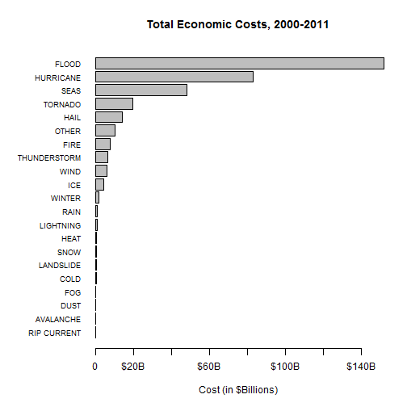

# Population Health and Economic Effects of Various Weather-Related Events, 2000-2011

## Synopsis: 
The U.S. National Oceanic and Atmospheric Administration's (NOAA) tracks various data for 
major weather related events across the United States.  The data includes health effects (injuries and fatalities)
and economic costs (property damage and crop damage).  The data 
was analyzed to determine which types of weather events have had the largest effects in terms of population health 
and economic damages for the time period from 2000 through 2011. The results are plotted below.
The results indicate that, with respect to population health, tornadoes are by far the most dangerous weather event, with nearly 2.5X as many casualties
as the next type, extreme heat.  Thunderstorms, lightning, and flooding round out the top 5.
In terms of economic damage, flooding is the most costly with roughly $150 billion in damages
over the time period.  This is followed by hurricanes, rough seas, tornadoes, and hail.


## Data Processing 
The raw data is provided by U.S. National Oceanic and Atmospheric Administration's (NOAA) storm database.
This database tracks characteristics of major storms and weather events in the United States since 1950, including 
when and where they occur, as well as estimates of any fatalities, injuries, and property damage.

We subset the data to include only the relevant columns for our analysis.  We then filter for only events that 
have happened since 2000.  Older storm data is not as relevant for several reasons: 

1. Older data is not as comprehensive as recent data.  
2. Storm warning systems and disaster response technologies have changed over time, affecting 
both casualty and economic data.  


```r
# read raw data
storm.df <- read.csv("data/repdata-data-StormData.csv")

# create sub dataset, filtering for dates since jan 1, 2000
library(dplyr,warn.conflicts=F)
storm.sub <- storm.df %>% 
                select(BGN_DATE,EVTYPE,INJURIES,FATALITIES,PROPDMG,PROPDMGEXP,CROPDMG,CROPDMGEXP) %>%
                mutate( BGN_DATE = as.Date(BGN_DATE, format="%m/%d/%Y %H:%M:%S") ) %>%
                filter( BGN_DATE >= as.Date("2000-01-01") ) 
```

Some event types (EVTYPE) overlap, e.g. "TSTM WINDS" and "THUNDERSTORM WINDS".  To account for this, we map
the individual event types into broader "event categories" (EVCAT), so that overlapping event types
are categorized similarly.  The mapping logic is shown below in the mapEVTYPE function.


```r
#
# Maps EVTYPES into broader categories.
#
# Many EVTYPES are similar, e.g. "THUNDERSTORM" and "TSTM".  This method
# attempts to map those near-duplicates into the same category.
#
mapEVTYPE <- function(evtype) {
    if (grepl("thunder|tstm|microburst",evtype,ignore.case=T)) {
        "THUNDERSTORM"
    } else if (grepl("tornado|waterspout",evtype,ignore.case=T)) {
        "TORNADO"
    } else if (grepl("hurricane|tropical storm|typhoon",evtype,ignore.case=T)) {
        "HURRICANE"
    } else if (grepl("wind",evtype,ignore.case=T)) {
        "WIND"
    } else if (grepl("heat|hyperthermia",evtype,ignore.case=T)) {
        "HEAT"
    } else if (grepl("snow|blizzard",evtype,ignore.case=T)) {
        "SNOW"
    } else if (grepl("flood|fld|rising water",evtype,ignore.case=T)) {
        "FLOOD"
    } else if (grepl("cold|hypothermia|low temp",evtype,ignore.case=T)) {
        "COLD"
    } else if (grepl("ice|icy|freez|sleet|frost|mix",evtype,ignore.case=T)) {
        "ICE"
    } else if (grepl("winter|wintry",evtype,ignore.case=T)) {
        "WINTER"
    } else if (grepl("rain",evtype,ignore.case=T)) {
        "RAIN"
    } else if (grepl("lightning",evtype,ignore.case=T)) {
        "LIGHTNING"
    } else if (grepl("rip current",evtype,ignore.case=T)) {
        "RIP CURRENT"
    } else if (grepl("fog",evtype,ignore.case=T)) {
        "FOG"
    } else if (grepl("seas|surf|surge|tsunami|wave|swell|tide|marine",evtype,ignore.case=T)) {
        "SEAS"
    } else if (grepl("fire",evtype,ignore.case=T)) {
        "FIRE"
    } else if (grepl("dust",evtype,ignore.case=T)) {
        "DUST"
    } else if (grepl("landslide|mudslide",evtype,ignore.case=T)) {
        "LANDSLIDE"
    } else if (grepl("hail",evtype,ignore.case=T)) {
        "HAIL"
    } else if (grepl("avalanche|glaze",evtype,ignore.case=T)) {
        as.character(evtype)
    } else {
        "OTHER"
    }
}

#
# Calls sapply(evtypes,mapEVTYPE).
# 
mapEVTYPEs <- function(evtypes) {
    sapply(evtypes,mapEVTYPE)
}
```

Further data processing is necessary to summarize with respect to health effects on the population.
Injuries (INJURIES) and fatalities (FATALITIES) are combined to determine the total number of casualties
(CASUALTIES).  The casualties are then summed up per event category (EVCAT).


```r
library(dplyr,warn.conflicts=F)
health.df <- storm.sub %>% 
                mutate(CASUALTIES = INJURIES + FATALITIES) %>%
                filter(CASUALTIES > 0) %>%
                mutate( EVCAT = mapEVTYPEs(EVTYPE) ) %>%
                group_by( EVCAT ) %>%
                summarize(CASUALTIES=sum(CASUALTIES)) %>%
                arrange(CASUALTIES)
```

In order to determine economic effects, we first calculate the nominal costs for each event by 
combining the property damage (PROPDMG) and PROPDMGEXP fields.  PROPDMG contains a number and 
PROPDMGEXP contains a letter, K, M, or B, that indicates the scale to apply to PROPDMG, where:

* K = Thousands
* M = Millions
* B = Bilions

The PROPDMGEXP value is mapped to its corresponding scaling factor by the mapDMGEXP function shown below.  


```r
#
# Maps PROPDMGEXP / CROPDMGEXP values (K,M,B) to a number (1000,1M,1B).
# The resulting value can then be multiplied by the PROPDMG / CROPDMG number
# to get the actual dollar amount.
#
mapDMGEXP <- function(dmgexp) {
    if (dmgexp == "K" || dmgexp == "k") {
        1000 
    } else if (dmgexp == "M" || dmgexp == "m") {
        1000 * 1000
    } else if (dmgexp == "B" || dmgexp == "b") {
        1000 * 1000 * 1000
    } else {
        1
    }
}

#
# Calls sapply(dmgexps,mapDMGEXP).
# 
mapDMGEXPs<- function(dmgexps) {
    sapply(dmgexps,mapDMGEXP)
}
```

The same calculation is done across the crop damage (CROPDMG) and CROPDMGEXP fields.  The property damage
and crop damage totals are then summed up per event category (EVCAT) and combined to determine the total economic cost (COST).

**Note:** Damage costs are recorded in nominal dollar values.  These values are NOT adjusted for inflation.
Given that we are using only recent data, and that inflation was relatively low during the time period, inflation
adjustment would not have a significant affect on the data or results.


```r
# filter for events that resulted in economic damage (PROPDMG + CROPDMG),
# map evtype into broader event categories (EVCAT), group by EVCAT, and plot.
econ.df <- storm.sub %>% 
                filter( PROPDMG > 0 | CROPDMG > 0 ) %>%
                mutate( PROPDMGEXP1 = mapDMGEXPs(PROPDMGEXP), CROPDMGEXP1 = mapDMGEXPs(CROPDMGEXP) ) %>%
                mutate( PROPDMGCOST = PROPDMG * PROPDMGEXP1, CROPDMGCOST = CROPDMG * CROPDMGEXP1) %>%
                mutate( EVCAT = mapEVTYPEs(EVTYPE) ) %>%
                group_by( EVCAT ) %>%
                summarize(COST=sum(PROPDMGCOST) + sum(CROPDMGCOST)) %>%
                arrange(COST)
```


## Results


#### Health Effects

The data show that **tornadoes** are by far the most dangerous type of weather event, in terms of human injuries
and fatalities.  Tornadoes resulted in over 16,000 casualties over the time period.  The 2nd most dangerous event,
extreme heat and heat-related events, accounted for roughly 6,000 casualties.  This was followed by thunderstorm and
lightning events, each with roughly 3,500 casualties.  The results are plotted below.

**Note:** *Tornado casualties are not shown in the chart*, since they are so much greater than the rest it would 
skew the coordinates and thus make it more difficult to view the results for other event types.


```r
tornadoes <- health.df[health.df$EVCAT=="TORNADO",]$CASUALTIES
main <- paste("Casualties, 2000-2011 (Tornadoes [", tornadoes, " casualties] not shown)",sep="")

par(mar=c(5, 8, 4, 2))
with(data=subset(health.df,EVCAT!="TORNADO"), 
     barplot(CASUALTIES, 
             names=EVCAT, 
             horiz=T, 
             las=1, 
             cex.names=0.75, 
             cex.main=0.9,
             main=main,
             xlab="Casualties (Injuries + Fatalities)") )
```

 


#### Economic Effects

The data shows that flooding is the most costly weather-related event type, in terms of economic damage.
Economic costs related to flooding were roughly $150
billion for the time period, followed next by hurricanes with approximately $80 billion in damages. 
Rough seas, which includes tsunamis, storm surges, and other marine events, incurred costs of about $50 billion,
followed by tornadoes (~$25 billion) and hail (~$15 billion).  The results are plotted below.


```r
par(mar=c(5, 8, 4, 2))
with(data=econ.df,
     barplot(COST, 
             names=EVCAT, 
             horiz=T, 
             las=1, 
             cex.names=0.75, 
             xlab="Cost (in $Billions)",
             axes=F,
             main="Total Economic Costs, 2000-2011") )
axis(1,
     at=c(0,20e+9,40e+9,60e+9,80e+9,100e+9,120e+9,140e+9),
     labels=c("0","$20B","","$60B","","$100B","","$140B"))
```

 


## Data Sources

Raw data available [here](https://d396qusza40orc.cloudfront.net/repdata%2Fdata%2FStormData.csv.bz2).  
National Weather Service [Storm Data Documentation](https://d396qusza40orc.cloudfront.net/repdata%2Fpeer2_doc%2Fpd01016005curr.pdf).  
National Climatic Data Center Storm Events [FAQ](https://d396qusza40orc.cloudfront.net/repdata%2Fpeer2_doc%2FNCDC%20Storm%20Events-FAQ%20Page.pdf).

